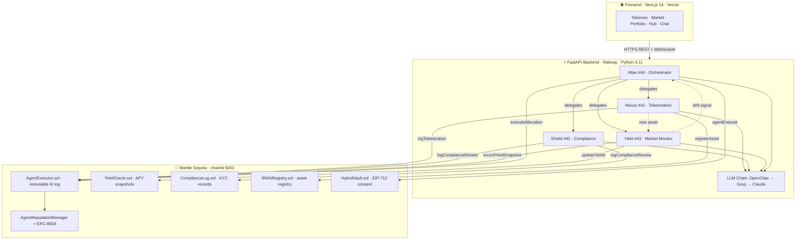

# RWAi — Sovereign AI Agents for Real World Assets on Mantle

> **Track:** AI & RWA Track · Turing Test Hackathon  
> **One-liner:** The first RWA platform where 4 ERC-8004 sovereign AI agents tokenize assets, manage portfolios, and answer to no one — every decision benchmarked on Mantle forever.

---

## The Problem

**1. Tokenizing a real-world asset costs $100,000 and takes months.**  
Lawyers, Solidity developers, compliance consultants — before a single token exists. Only institutions can afford this. Retail asset owners are locked out entirely.

**2. Mantle's native RWA ecosystem (USDY, mETH, fBTC, mUSD) has no intelligent layer.**  
The assets are excellent. The yield is real. But there is no system that tells a retail investor *what* to buy, *how much*, and *when to rebalance* — based on their risk profile, on current data, on their actual wallet.

**3. On-chain AI has a trust crisis.**  
AI agents are executing decisions that move real money — but there is no verifiable identity, no reputation trail, no auditable record of who decided what and why. When an AI agent acts, it leaves no proof it ever existed.

---

## The Solution

**RWAi** puts four ERC-8004 sovereign AI agents to work on these three problems simultaneously.

```
Asset Owner                          Investor
     │                                   │
     ▼                                   ▼
[Upload PDF/DOCX]              [Tell Atlas what you want]
     │                          (text or VOICE command)
     ▼                                   │
[NEXUS analyzes doc]           [ATLAS builds strategy]
[SHIELD validates compliance]  [YIELD prices the assets]
     │                                   │
     ▼                                   ▼
[ERC-20 deployed on Mantle]    [Allocation executed on Mantle]
     │                                   │
     └──────────────┬────────────────────┘
                    ▼
        AgentExecutor.sol — immutable on-chain log
        Every decision. Every agent. Every outcome.
        Permanently benchmarked on Mantle.
```

**For asset owners:** Upload a PDF deed or income statement → Nexus extracts asset metadata, Yield prices it, Shield scores compliance → ERC-20 token deployed on Mantle in minutes. Cost: gas only.

**For investors:** Talk to Atlas (text or voice) → Atlas coordinates Nexus + Shield + Yield → recommends a strategy across real Mantle RWAs → executes allocation → writes reasoning on-chain with its ERC-8004 identity as proof.

**For everyone:** Every AI decision is logged immutably in `AgentExecutor.sol`. Every agent action is signed by its ERC-8004 identity NFT. Reputation score (0–100) gates autonomy level. This is the first verifiable AI performance benchmark on Mantle.

---

## Why This Wins the Turing Test

The three defining criteria of this hackathon — built into RWAi's core:

| Hackathon Criterion | How RWAi Delivers |
|---|---|
| **On-chain benchmarking of AI** | `AgentExecutor.sol` logs every agent decision on Mantle — queryable, permanent, the first RWA AI benchmark on-chain |
| **ERC-8004 agent identity** | 4 agents registered (nexus=41, shield=42, yield=43, atlas=44), reputation gating live, reputation mirrors to ERC-8004 on-chain |
| **Radical transparency** | Atlas voice interface — watch the agent hear your command, reason, execute, and write proof to Mantle in real time |

---

## System Architecture



---

## Per-Agent Architecture

### Nexus #41 — Tokenization
```
User uploads PDF/DOCX
  → Nexus: extract value · supply · APY · symbol · concerns
  → Shield: auto-delegated compliance review (4-category score)
  → AgentExecutor.logTokenization() + RWAiRegistry.registerAsset()
  → [background] Yield notified: new asset enters monitoring immediately
  → Token live in Market
```

### Shield #42 — Compliance
```
Asset document + jurisdiction + owner wallet
  → 4-category scoring:
      Document completeness  (30%) — all required docs present?
      Ownership clarity      (25%) — clean title, no encumbrances?
      Jurisdictional risk    (25%) — Reg D / MiFID II / MAS / FCA?
      Sanctions screening    (20%) — wallet vs OFAC / EU sanctions lists
  → Score ≥ 70 → CLEARED  → ComplianceLog.sol + AgentExecutor
  → Score < 70 → BLOCKED  → deployment prevented (score defaults to 0 on failure)
```

### Yield #43 — Market Monitor
```
[30s after startup] then [every 6 hours] + [on every new tokenization]
  → LLM: fetch USDY · mETH · MI4 · fBTC · mUSD yields
  → Compare vs previous snapshot — drift > 100bps triggers DRIFT ALERT
  → YieldOracle.updateYields() + AgentExecutor.recordYieldSnapshot()
  → DRIFT ALERT written on-chain as separate action → Atlas receives signal
```

### Atlas #44 — Orchestration
```
User message (text or voice)
  → Intent detection:
      yield / apy / market   → delegate to Yield (live APY data)
      compliance / kyc       → delegate to Shield (review context)
      tokenize / asset       → delegate to Nexus (tokenization brief)
  → Sub-agent result injected into Atlas context
  → Read live APY from YieldOracle.getLatestYield() on-chain
  → Strategy → AgentExecutor.executeAllocation()
  → HybridVault EIP-712 consent → autonomous rebalance within user's cap
```

---

## The 4 ERC-8004 Agents

| Agent | ERC-8004 ID | Role | Primary On-Chain Action |
|-------|------------|------|------------------------|
| **Nexus** | 41 | Tokenizes RWAs from documents | `AgentExecutor.logTokenization()` |
| **Shield** | 42 | AI compliance review — KYC/AML, sanctions, risk scoring | `AgentExecutor.logComplianceReview()` |
| **Yield** | 43 | Prices assets via Pyth, monitors APY across Mantle RWAs | `YieldOracle.updatePrice()` / `createMarketSnapshot()` |
| **Atlas** | 44 | Portfolio strategy, voice commands, autonomous execution | `AgentExecutor.executeAllocation()` / `executeRebalance()` |

**Reputation scores (live on Mantle Sepolia):** Nexus: 85 · Shield: 75 · Yield: 75 · Atlas: 75  
Higher reputation → more autonomous actions permitted. Agents earn reputation through successful on-chain decisions.

**Agent runtime:** OpenClaw/CMDOP primary → Groq (llama-3.3-70b) → Claude fallback. Model-agnostic, 4-level chain.

---

## Autonomous Agent Control — HybridVault + EIP-712 Capped Consent

This is the feature that separates RWAi from every other "AI + RWA" project: **Atlas does not just recommend — it executes.**

Most AI portfolio tools give advice. Atlas acts. But acting with someone's money requires trust. RWAi solves this with **capped consent** — a single EIP-712 signature that gives Atlas a bounded, revocable allowance to operate autonomously.

```
User signs once (EIP-712)
  └─ "Atlas may move up to $500 from my HybridVault"

Atlas detects opportunity → executes rebalance autonomously
  └─ No per-transaction approvals needed within the cap

Every autonomous action is logged on AgentExecutor.sol
  └─ ERC-8004 identity of Atlas is the signer — permanent proof

Allowance exhausted → Atlas requests new consent
  └─ User is always in control of the ceiling
```

**Why this matters for the scoring criteria:**

- *AI × RWA depth* — AI is the execution layer, not a chatbot. Atlas signs and submits transactions.
- *Mantle integration* — HybridVault.sol lives on Mantle. Every autonomous action is an on-chain event.
- *Path B Application* — this is what "AI-driven RWA application" means: an agent that lowers the barrier by acting on the user's behalf, within explicit consent bounds.

**How consent works (EIP-712):**

```typescript
// User signs this structure — no private key exposure, no full custody
{
  domain: { name: "RWAi HybridVault", chainId: 5003 },
  types:  { AgentConsent: [
    { name: "agent",      type: "address" },  // Atlas wallet
    { name: "allowance",  type: "uint256" },  // cap in wei
    { name: "deadline",   type: "uint256" },  // expiry
    { name: "nonce",      type: "uint256" },  // replay protection
  ]},
  message: { agent, allowance, deadline, nonce }
}
```

The signature is submitted to `HybridVault.relayAllowance()`. From that point, Atlas can call `HybridVault.agentExecute()` for actions up to the cap — each deducting from the allowance, each logged permanently on `AgentExecutor.sol`.

---

## Architecture

```
Browser (Next.js 14)
  │  wagmi v2 + viem · Mantle Sepolia · WalletConnect
  │
  ▼
FastAPI Backend (agents/)
  │  OpenClaw/CMDOP → Groq → Claude (4-level fallback)
  │  Every decision logged on-chain before response returned
  │
  ▼
Mantle Sepolia (chainId 5003)
  ├── AgentExecutor.sol          — immutable AI action log (the benchmark)
  ├── AgentReputationManager.sol — reputation score + ERC-8004 mirror
  ├── YieldOracle.sol            — Pyth USD prices + APY market snapshots
  ├── ComplianceLog.sol          — Shield's KYC/AML decisions
  ├── RWAiRegistry.sol           — tokenized asset registry
  ├── AssetToken.sol             — ERC-20 fractional RWA token
  ├── PortfolioVault.sol         — strategy (bps) + execution
  └── HybridVault.sol            — user deposits + EIP-712 agent consent

ERC-8004 (Mantle Sepolia — official pre-deployed)
  Identity:   0x8004A818BFB912233c491871b3d84c89A494BD9e
  Reputation: 0x8004B663056A597Dffe9eCcC1965A193B7388713
```

---

## Contract Addresses (Mantle Sepolia)

| Contract | Address |
|----------|---------|
| AgentExecutor | `0x9a822B9A50D090CfcCa1e6474efCd653112d8501` |
| AgentReputationManager | `0xfFE21EC80012D3Bf00F5eE20a400C94455F32D32` |
| YieldOracle | `0x1288dF9F55673cBFc97BCe7aD5445D77B9029B92` |
| ComplianceLog | `0xCc6296557c05ca02f3258DEd19f4104a9C19a80B` |
| RWAiRegistry | `0xeE7a50936a25a375143b75b7Ca743B9513368680` |
| PortfolioVault | `0xf7C43D8fe74712130C0a05D1F58A33515E2C63E4` |
| HybridVault | `0xC6c08db835636Cf40530dDf90Bf3Bb15bc78190D` |
| AssetToken (template) | `0x80E0e5f6488FA2726c042a204344281974f72609` |
| ERC-8004 Identity | `0x8004A818BFB912233c491871b3d84c89A494BD9e` |
| ERC-8004 Reputation | `0x8004B663056A597Dffe9eCcC1965A193B7388713` |

**Mock RWA Tokens on Mantle Sepolia**

| Token | Address |
|-------|---------|
| Mock USDY | `0xcE265E23aAc349cEf9Fa3CC058062A44080f2289` |
| Mock mUSD | `0xDf079DB274fAEFfeD10A4a0E5C12f65e1570Cd35` |
| Mock mETH | `0xD57f88B64611dBf74f87FC40f2F1010320483584` |
| Mock fBTC | `0xbED7ad48984fBb3984F5aF83E176fb9f40dB37cc` |

**Agent Wallet:** `0x834De729cb9dF77451DBc6bf7FD05F475B011Ac7`  
Explorer: https://sepolia.mantlescan.xyz

---

## Repository Structure

```
rwai/
├── contracts/          # 8 Solidity contracts · Hardhat · 46 passing tests
├── agents/             # FastAPI backend · 4 AI agents · OpenClaw runtime
│   ├── api/routes/     # chat, tokenize, compliance, yield, portfolio, market
│   ├── mantle/         # Web3 client, executor, reputation, Pyth, db
│   └── skills/         # nexus.md, shield.md, yield.md, atlas.md
└── app/                # Next.js 14 frontend
    ├── app/            # /, /hub, /tokenize, /market, /portfolio, /chat, /voice, /docs
    └── components/     # Agent monograms, TopBar, MeshBackground
```

---

## Live Demo

| Resource | Link |
|----------|------|
| Frontend | https://rwai-theta.vercel.app |
| Backend API | https://rwai-production.up.railway.app |
| Swagger UI | https://rwai-production.up.railway.app/docs |
| Mantle Explorer | https://sepolia.mantlescan.xyz |
| Agent Wallet | [0x834De...Ac7](https://sepolia.mantlescan.xyz/address/0x834De729cb9dF77451DBc6bf7FD05F475B011Ac7) |
| AgentExecutor | [0x9a822B...501](https://sepolia.mantlescan.xyz/address/0x9a822B9A50D090CfcCa1e6474efCd653112d8501) |
| Demo Video | *(YouTube/Loom URL — add before submit)* |

---

## Revenue Model

RWAi captures value at three protocol layers — every fee is on-chain, auditable, and enforced by smart contracts.

| Stream | Rate | Mechanism |
|--------|------|-----------|
| **Tokenization fee** | 0.5% of stated asset value | Charged at `AgentExecutor.logTokenization()` — paid in MNT or USDY when Nexus deploys an ERC-20 RWA token |
| **Protocol fee on AUM** | 0.3% / year | Streamed continuously from `HybridVault` deposits; Atlas-managed positions pay into the protocol treasury |
| **Market transaction fee** | 0.15% of trade value | Collected on every buy/sell routed through the RWA Market; split 80% treasury / 20% Shield compliance fund |
| **Agent API (enterprise)** | $299–$999 / month | Institutions call Atlas, Nexus, Shield, Yield directly via REST — higher consent caps, SLA, dedicated indexer |

**Unit economics at scale (illustrative):**
- $50M AUM → $150,000 / year from vault fee alone
- 100 tokenizations × avg $500K asset → $250,000 single quarter
- Market volume $5M / month → $90,000 / year in transaction fees

All fees flow to `ProtocolTreasury` — governed by $RWAI stakers, not the founding team.

---

## Tokenomics

**$RWAI** is the protocol governance and fee-capture token. It is not required to use the product — retail users interact purely with MNT and RWA tokens. $RWAI exists to align long-term stakeholders.

### Utility

| Function | How |
|----------|-----|
| **Governance** | Vote on fee parameters, new asset type whitelists, agent reputation thresholds |
| **Fee sharing** | Stake $RWAI → earn 70% of protocol fees pro-rata (30% to treasury) |
| **Agent licensing** | New third-party ERC-8004 agents must bond $RWAI; slashed on malicious actions |
| **Discount** | Tokenization fee reduced to 0.2% if paid in $RWAI (vs 0.5% in MNT) |
| **Reputation boost** | Agents backed by staked $RWAI start with higher base reputation (up to +10 points) |

### Supply & Distribution

**Total supply: 100,000,000 $RWAI** — fixed, no inflation.

| Allocation | % | Tokens | Vesting |
|------------|---|--------|---------|
| Ecosystem & grants | 25% | 25M | 4 years linear |
| Protocol treasury | 20% | 20M | DAO-controlled |
| Team & contributors | 18% | 18M | 1-year cliff, 3-year linear |
| Community & airdrops | 15% | 15M | 6-month cliff, then linear |
| Investors (seed) | 12% | 12M | 6-month cliff, 2-year linear |
| Liquidity provision | 10% | 10M | Unlocked at TGE for DEX pools |

**Launch:** $RWAI launches on Mantle after mainnet deployment. Initial liquidity seeded on FusionX (Mantle-native DEX). No presale, no VC dump — team tokens cliff at 12 months.

---

## Go-to-Market Strategy

### Target Segments

**Primary (Year 1):** Crypto-native retail investors on Mantle who already hold USDY, mETH, mUSD, fBTC — they have the assets but no intelligent allocation layer. Zero acquisition cost barrier: Atlas speaks to them in plain English (or voice).

**Secondary (Year 1–2):** SME asset owners (real estate, invoice, commodity) who cannot afford $100K traditional tokenization. RWAi reduces this to gas fees + 0.5% protocol fee.

**Tertiary (Year 2+):** Institutional desks who need verifiable AI decision audit trails — `AgentExecutor.sol` is the only on-chain AI benchmark that exists today.

### Phases

```
Phase 1 — Seed (Now, Testnet)
  └── Hackathon submission → developer mindshare
  └── Open source → forks become distribution
  └── ERC-8004 standard → Mantle ecosystem becomes dependency

Phase 2 — Mainnet Alpha (Q3 2026)
  └── Deploy to Mantle mainnet (Mantle assets: real USDY, mETH)
  └── Partner with Mantle Foundation for co-marketing
  └── Onboard first 10 asset tokenizations (target: real estate, invoices)
  └── JARVIS voice interface as viral acquisition hook

Phase 3 — Growth (Q4 2026)
  └── Integrate real KYC provider (Fractal ID or Sumsub) into Shield agent
  └── $RWAI token launch on FusionX
  └── Enterprise API tier — target family offices and asset managers
  └── Agent marketplace: third parties deploy ERC-8004 agents, bond $RWAI

Phase 4 — Scale (2027+)
  └── Cross-chain (OP Stack, Arbitrum) — AgentExecutor bridges via LayerZero
  └── RWA index products managed autonomously by Atlas
  └── Regulatory sandbox applications (MAS Singapore, ADGM Abu Dhabi)
```

### Distribution Channels

- **Mantle ecosystem programs** — grants, co-marketing, Mantle DeFi integrations
- **Voice-first virality** — JARVIS demo clips on X/Twitter; "speak to your portfolio" is inherently shareable
- **Developer adoption** — ERC-8004 agent SDK; any team building AI × DeFi becomes a distribution partner
- **Asset owner outreach** — direct to SMEs via real estate tokenization communities (RWA.xyz, Centrifuge community)

### Competitive Moat

| Competitor | Gap | RWAi advantage |
|------------|-----|----------------|
| Ondo Finance | No AI, no voice, no agent autonomy | Atlas executes, not just recommends |
| Centrifuge | No AI layer, Substrate chain | Mantle-native, Atlas voice interface |
| OpenTrade | Institutional only, no retail | Retail-first, $10K minimum via HybridVault |
| Generic AI chatbots | No on-chain proof | `AgentExecutor.sol` = immutable AI audit trail |

**The irreplaceable asset:** `AgentExecutor.sol` accumulates every AI decision ever made on RWAi. By the time competitors build equivalent infrastructure, RWAi will have months of verifiable on-chain AI performance data — a benchmark no one can fake retroactively.

---

## Open Source

This project is fully open source under the **MIT License**.

```
MIT License — Copyright (c) 2026 RWAi Contributors
Permission is hereby granted, free of charge, to any person obtaining a copy
of this software to use, copy, modify, merge, publish, distribute the software,
subject to the following conditions: The above copyright notice shall be included
in all copies. THE SOFTWARE IS PROVIDED "AS IS", WITHOUT WARRANTY OF ANY KIND.
```

**Contributions welcome.** The codebase is structured so each layer (contracts, agents, frontend) can be developed independently. See each subdirectory for its own README.

---

## Quick Start

```bash
# Install all dependencies
make install

# Configure environment
cp contracts/.env.example contracts/.env   # add PRIVATE_KEY
cp agents/.env.example agents/.env         # add GROQ_API_KEY + AGENT_PRIVATE_KEY

# Deploy contracts + register agents
make production-testnet

# Start dev servers
make dev
# Backend  → http://localhost:8001
# Frontend → http://localhost:3000
```

---

## API Reference (port 8001)

| Method | Path | Agent | Description |
|--------|------|-------|-------------|
| POST | `/api/agents/chat` | any | Conversational interface — text or voice transcript |
| POST | `/api/agents/tokenize` | Nexus | PDF/DOCX → token params + on-chain log |
| POST | `/api/agents/compliance` | Shield | KYC/AML review → on-chain compliance record |
| GET | `/api/agents/yield` | Yield | Live APY snapshot → writes to YieldOracle |
| GET | `/api/agents/yield/prices` | Yield | Pyth price feed → writes USD prices on-chain |
| POST | `/api/agents/portfolio/plan` | Atlas | Strategy → writes allocation on-chain |
| POST | `/api/agents/portfolio/rebalance` | Atlas | Rebalance → writes rebalance on-chain |
| GET | `/api/agents/market/listings` | — | All user-tokenized RWA listings |
| POST | `/api/agents/market/buy` | Atlas | Log purchase on-chain with AI reasoning |
| POST | `/api/agents/market/sell` | Atlas | Log sell on-chain (RWA → USDY) with AI reasoning |
| GET | `/api/agents/status` | — | Live ERC-8004 reputation scores for all agents |

Swagger UI: http://localhost:8001/docs

---

## Hackathon Submission Checklist

- [x] 8 contracts deployed on Mantle Sepolia (chainId 5003)
- [x] 4 agents registered on ERC-8004 Identity Registry (nexus=41, shield=42, yield=43, atlas=44)
- [x] Reputation system live and gating autonomy
- [x] On-chain action logging: tokenization, compliance, allocation, rebalance, buy, sell
- [x] OpenClaw/CMDOP as primary agent runtime
- [x] Full tokenize flow: PDF → AI analysis → ERC-20 on Mantle
- [x] RWA Market: list, buy, sell with Atlas AI reasoning on-chain
- [x] Portfolio management with Atlas
- [x] Atlas voice interface (Jarvis-style) — speak to your AI agent
- [x] 46 contract tests passing
- [x] Live frontend on Vercel — https://rwai-theta.vercel.app
- [x] Agent backend deployed on Railway — https://rwai-production.up.railway.app
- [ ] Demo video (3–4 min) — voice command → Atlas executes → on-chain proof shown

---

## Scoring Alignment

**General (60%)**
- *AI × RWA depth*: AI is not a chatbot — it's the execution layer. Every tokenization, every allocation, every rebalance is an AI agent action with on-chain proof.
- *Technical completeness*: 8 contracts, 4 agents, full tokenize + market + portfolio flows, voice interface — end-to-end.
- *Mantle integration*: ERC-8004, AgentExecutor, YieldOracle with Pyth, HybridVault with EIP-712 consent, 4 mock RWA tokens.
- *Compliance awareness*: Shield agent scores every asset. ComplianceLog.sol records every decision on-chain.

**Track-specific (40%) — Path A + B**
- *Infrastructure*: Complete tokenization flow — document in, ERC-20 out, compliance logged, price set.
- *Application*: Atlas voice interface — retail investors speak their intent, agent executes, on-chain proof returned.

---

*RWAi · Solidity 0.8.24 · OpenZeppelin v5 · ERC-8004 · FastAPI · OpenClaw · Next.js 14 · Mantle Network*
